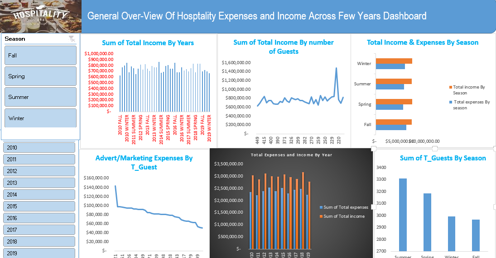

# Project 1

**Title:** [General Over-View Of Hosptality Expenses and Income Across Few Years Dashboard](https://github.com/Aimiebenomon/Aimiebenomon.github.io/blob/main/Pofolio%20Project%201.xlsx)

**Tools Used:** Microsoft Excel (Pivot Table, Pivot Chart, Conditional Formatting,Text Box, Slicers, Timelines)

**Project Description:**

This project involved analysing income and expenses in hospitality industry to identify trends and patterns in sales performance as against expenses across a decade. It is designed to provide a comprehensive overview of key performance metrics. This dashboard allows stakeholders to easily monitor and analyze the company’s performance across different years and seasons. The dashboard includes the following features:
Sum of Total Income by Year: Visual representation of income generated each year.
Sum of Total Income by Number of Guests: A breakdown of the total income generated depending on the number of guests, providing insights of how the income realised is affected by the number of guests.
Total Income by Season: Displays the seasonal income, allowing for easy comparison of profitability throughout the year.
Advert/Marketing Expenses by Total Number of Guests: Highlights the trends of the effect advert/expenses have on occupancy rate; analysing significant effect it exert on revenue generation.
Total Expenses and Income by Year: Displays yearly income and expenses to ascertain if it is the same trend across each year.
Sum of Total Guest by Season: Visual representation of the trend in the number of guests across each season.
Additionally, the dashboard includes interactive slicers for:
Year: Filter the data to view performance for a specific year.
Seasons: Focus on specific season to analyze seasonal performance.
 
**Key findings:**

Seasonal Profitability: Identified the most profitable Seasons and highlighted seasons where performance could be improved.
Yearly Trends: Revealed patterns in sales and profit that correspond with yearly events, allowing for more strategic planning.
Top-Performing Seasons: Highlighted which seasons are driving the most revenue and profit, aiding in inventory and marketing decisions.
Sales Volatility: Analyzed seasonal sales fluctuations to understand market dynamics and adjust business strategies accordingly.
This dashboard serves as a crucial tool for the hospitality company’s management team, providing clear, actionable insights that drive informed decision-making and strategic planning.
 

**Dashboard Overview:**

#Project 2 
 
**Title:** Sales Data - Data Manipulation and Interogation

**SQL Code:** [Sales Data SQL Codes](https://github.com/Aimiebenomon/Aimiebenomon.github.io/blob/main/Sales%20Data)

**SQL Skills Used:** 

Data Retrieval (SELECT): Queried and extracted specific information from the database.
Data Aggregation (SUM, COUNT): Calculated totals, such as sales and quantities, and counted records to analyze data trends.
Data Filtering (WHERE, BETWEEN, IN, AND): Applied filters to select relevant data, including filtering by ranges and lists.
Data Source Specification (FROM): Specified the tables used as data sources for retrieval
 

**Project Description:**

This project aims to analyze customer sales and revenue data using SQL to extract insights that drive business decisions. The dataset consists of customer transactions, order details, and product information from an e-commerce business.
Using SQL, the project performs data cleaning, aggregation, and complex queries to identify key business metrics such as total sales, average order value, customer segmentation, and product performance.
Data cleaning and transformation using SQL functions (e.g., CASE, COALESCE, TRIM).
Sales trend analysis using time-based aggregations (GROUP BY, DATE_TRUNC).
Customer segmentation based on purchase behavior (JOIN, RANK, DENSE_RANK).
Revenue contribution by product category (SUM, AVG, PARTITION BY).
 
 
**Technology used:** SQL server
 
